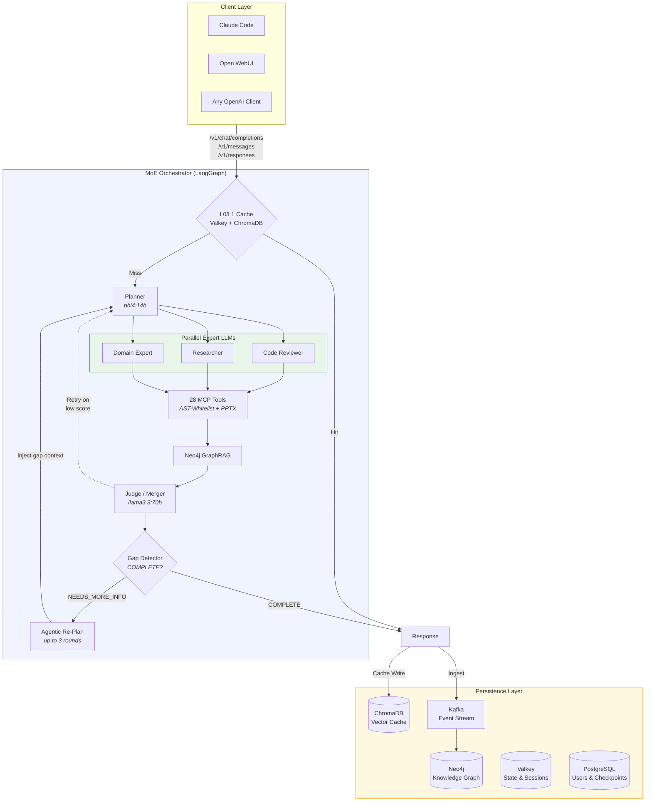
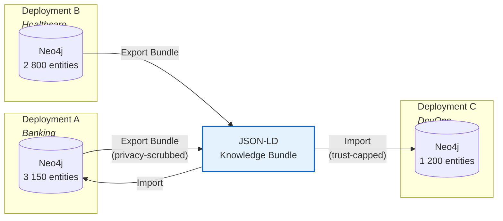
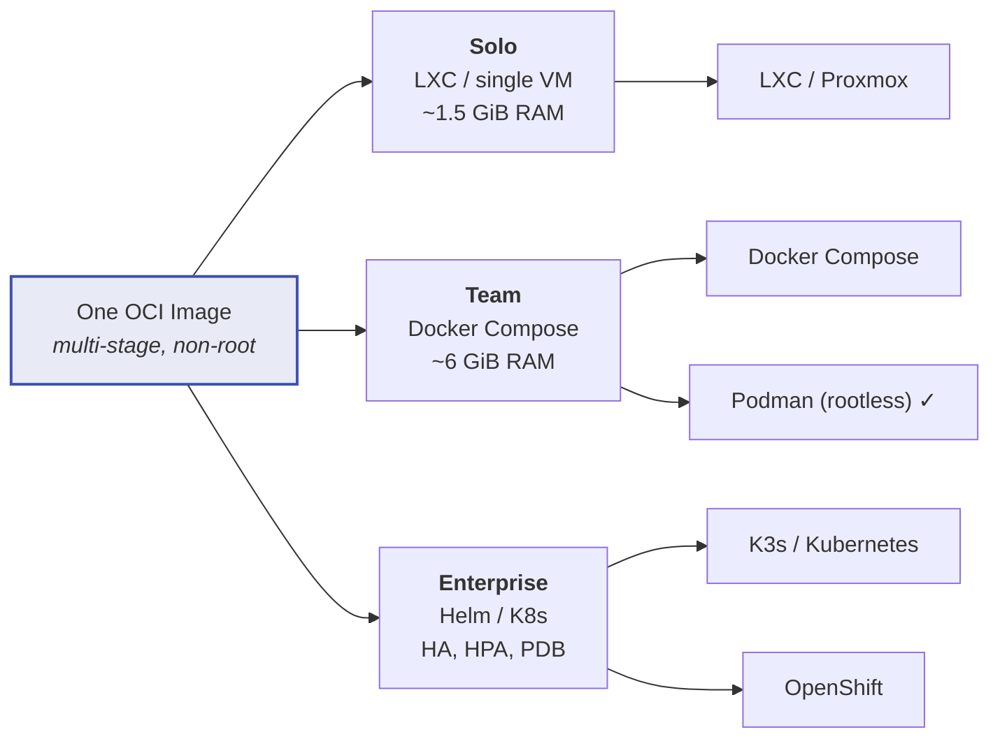

<div align="center">

# MoE Sovereign

**A Self-Hosted Multi-Model Orchestrator with Template-Based Expert Routing<br>for Sovereign AI Infrastructure**

[](LICENSE)
[](#deployment-targets)
[](#)
[](https://docs.moe-sovereign.org)
[](#funded-research-eurohpc-lumi-g)

[Documentation](https://docs.moe-sovereign.org) &bull;
[Website](https://moe-sovereign.org) &bull;
[Issues](https://github.com/moe-sovereign/moe-sovereign/issues) &bull;
[Changelog](CHANGELOG.md)

</div>

---

## Motivation

Commercial AI APIs process every request on infrastructure the customer neither owns nor can inspect. Training-data extraction, prompt logging, and retroactive policy changes are documented incidents. The European regulatory framework --- in particular GDPR Articles 25 and 32 --- mandates data protection by design, a requirement difficult to discharge with an opaque black box in a foreign jurisdiction.

**MoE Sovereign** is a fully self-hosted multi-model orchestrator with template-based expert routing that runs entirely on your own hardware. No data leaves your network. No cloud dependency. No vendor lock-in.

---

## Architecture



### Pipeline Stages

| Stage | Description |
|:---:|---|
| **1. Cache** | L0 query-hash (Valkey, 30 min TTL), L1 semantic similarity (ChromaDB, cosine &lt; 0.15), and a conservative **knowledge-bypass** tier: similar-but-not-exact queries skip the LLM when the prior answer was high-confidence and still fresh (cosine &lt; 0.25, confidence &ge; 0.85, within TTL) |
| **2. Planner** | Decomposes request into 1--4 subtasks with expert category assignment |
| **3. Experts** | T1 models (&le;20B) screen with confidence gating; T2 (24--80B) engage only on low confidence |
| **4. Tools** | 28 MCP precision tools (math, subnet, date, legal, PPTX) via AST-whitelist — eliminates hallucinations within the deterministic computation boundary |
| **5. GraphRAG** | Neo4j context enrichment with domain-scoped entity filters and trust-score decay. CAG layer intercepts static compliance domains (BAIT, VAIT, DORA, KRITIS) before the Neo4j query and injects pre-loaded authoritative text directly. Corrective RAG gate (Yan et al. 2024) scores each retrieved entity for query relevance and discards low-signal results before injection. Episode hints from past similar tasks are appended as routing context |
| **6. Judge** | Synthesises expert outputs, evaluates quality, retries on failure (up to 3 attempts) |
| **7. Agentic Re-Plan** | Lightweight gap detector checks completeness; if unresolved, injects findings into a new planner round (up to 3 agentic iterations) |
| **8. Ingest** | Validated knowledge flows back into Neo4j via Kafka for graph accumulation acceleration |

### Module Structure

The orchestrator codebase is organised into focused packages. `main.py` is a thin entry point (~1 500 LOC) holding the FastAPI app, lifespan, middleware, and graph wiring. All domain logic lives in dedicated packages:

```
moe-infra/
├── main.py                    # FastAPI app, lifespan, middleware, graph wiring (~1 500 LOC)
├── config.py                  # All os.getenv() — typed config constants
├── state.py                   # Shared mutable globals (redis_client, _userdb_pool, …)
├── prompts.py                 # Static prompt text + routing detection regexes
├── metrics.py                 # Single Prometheus registry
├── parsing.py                 # Stateless parsers: JSON extraction, confidence, history truncation
├── context_budget.py          # Per-model context-window estimation
│
├── routes/                    # FastAPI APIRouters (one per concern)
│   ├── health.py              # /health, /metrics
│   ├── watchdog.py            # /api/watchdog/*, Starfleet feature toggles
│   ├── mission_context.py     # /api/mission-context
│   ├── graph.py               # /graph/*
│   ├── feedback.py            # /v1/feedback, /v1/memory/ingest
│   ├── admin_*.py             # Benchmark, ontology, stats admin endpoints
│   ├── models.py              # /v1/models
│   ├── ollama_compat.py       # /api/* (Ollama protocol)
│   └── anthropic_compat.py    # /v1/messages, /v1/responses, /v1/chat/completions
│
├── services/                  # Business logic — no FastAPI imports
│   ├── auth.py                # OIDC + API key validation + budget enforcement
│   ├── tracking.py            # Usage logging, request lifecycle, budget counters
│   ├── routing.py             # Expert template + per-template prompt resolution
│   ├── templates.py           # Expert template + Claude Code profile loading
│   ├── llm_instances.py       # ChatOpenAI singletons (judge, planner, ingest, search)
│   ├── inference.py           # Node selection, fallback chain, Thompson sampling
│   ├── helpers.py             # Progress reports, semantic memory, self-evaluation
│   ├── skills.py              # Server-side skill resolution + ADMIN_APPROVED hard-lock
│   ├── healer.py              # Ontology gap-healer (one-shot + dedicated subprocess)
│   ├── kafka.py               # Fire-and-forget Kafka publish helper
│   └── pipeline/              # OpenAI / Anthropic / Ollama / Responses API handlers
│       ├── chat.py            # OpenAI chat completions
│       ├── anthropic.py       # Anthropic Messages API + tool/MoE/reasoning handlers
│       ├── ollama.py          # Ollama-protocol streaming wrappers
│       └── responses.py       # OpenAI Responses API
│
├── graph/                     # LangGraph node implementations
│   ├── router_nodes.py        # cache_lookup, semantic_router, fuzzy_router, _route_cache
│   ├── tool_nodes.py          # mcp_node, graph_rag_node, math_node_wrapper
│   ├── planner.py             # planner_node + plan sanitization + topological levels
│   ├── expert.py              # expert_worker (parallel expert execution)
│   ├── research.py            # research_node + research_fallback + domain extraction
│   └── synthesis.py           # merger_node, thinking_node, resolve_conflicts_node, critic_node
│
├── pipeline/
│   ├── __init__.py            # LangGraph graph builder — assembles nodes into the pipeline DAG
│   └── state.py               # AgentState TypedDict (67 fields across 3 categories)
│
├── web_search.py              # SearXNG integration with domain-reliability scoring
├── math_node.py               # SymPy-backed math node (solve, integrate, differentiate)
├── graph_rag/                 # GraphRAG query, entity linking, ontology, corrections
├── federation/                # Push / pull federation client to MoE Libris hubs
├── mcp_server/                # 28 MCP precision tools (AST-whitelisted)
├── admin_ui/                  # Admin backend: experts, users, budgets, cleanup manager
├── prompts/systemprompt/      # 15 expert system prompts (English, "Respond in German.")
├── tests/                     # 195 unit + integration + smoke tests (all green)
└── benchmarks/                # Overnight benchmark suite, GAIA runner, result injection
```

The orchestrator started as an 11 190-line monolith in `main.py`. A 14-phase split (Q2 2026) decomposed it into the structure above without a single behavioural change — every phase ended with the full test suite green. See `docs/ARCHITECTURE.md` for the detailed module map.

---

## Key Capabilities

### A) Core AI & Orchestration

| | Capability | Description |
|:---:|---|---|
| **1** | Deterministic Expert Routing | Versioned, auditable templates --- not a probabilistic black box |
| **2** | Two-Tier Escalation | T1 screens fast; T2 engages only when needed --- incl. a low-confidence rescue that lets a trivial query escalate to T2 when T1 returns weak/empty output (`TRIVIAL_LOW_CONF_RESCUE_ENABLED`) |
| **3** | Neo4j GraphRAG | Trust-score self-healing, contradiction detection, domain-scoped filters |
| **4** | Community Knowledge Bundles | Export/import learned knowledge as JSON-LD with regex-based privacy scrubbing (PII, secrets, hostnames) |
| **5** | 51 MCP Precision Tools | AST-whitelisted --- 100% accuracy on deterministic tasks; includes wikidata_sparql, pubmed_search, crossref_lookup, openalex_search, duckduckgo_search, web_browser (Splash JS rendering), wayback_fetch, github_search_issues with fuzzy label resolution |
| **6** | VRAM-Aware Scheduling | Per-node VRAM limits, warm-model affinity, sticky sessions |
| **8** | Claude Code Integration | Full Anthropic Messages API with 6 profiles and streaming thinking blocks |
| **9** | Deployment Flexibility | One OCI image &rarr; LXC (tested), Docker Compose (tested), Podman rootless (tested), Helm/K8s (architecturally prepared, community validation requested) |
| **10** | 9.3&times; Accumulation Speedup | 707 s &rarr; 76 s latency over 5 benchmark epochs |
| **12** | Agentic Re-Planning Loop | After each synthesis the Judge checks completeness; unresolved gaps trigger a focused re-plan with injected context --- up to 3 autonomous iterations per request; domain-aware search cache prevents result poisoning across iterations |
| **13** | PowerPoint Generation | MCP `generate_pptx` tool creates fully formatted `.pptx` presentations from structured content and delivers them as signed Garage (S3) download links |
| **18** | Dynamic Sequential/Parallel Experts | Planner tasks support `depends_on` for multi-hop chains (e.g. find author → find their papers). Independent tasks run in parallel; dependent tasks execute sequentially with result injection via `{result_of:id}` placeholders |
| **19** | Adaptive Context Budget | Context window limits per model auto-scale web-research blocks and GraphRAG budget. Fallback models (phi4:14b-fp16 16K, qwen3.6:35b 32K) receive proportionally smaller context slices |
| **20** | GraphRAG On-Demand | Neo4j queries skipped for external research questions (papers, APIs, media) — only runs for internal knowledge queries or when the plan includes a knowledge_healing task |
| **21** | OpenAI Responses API (`/v1/responses`) | Full Responses API streaming with correct SSE events (`sequence_number`, `output_index`, `content_index`) — enables Codex CLI, Continue.dev, and any OpenAI Responses API compatible agent out of the box |
| **23** | Chess Analysis via Lichess | MCP tool `chess_analyze_position` queries Lichess cloud Stockfish (342M positions, depth 20–99) for best moves given a FEN string — no local engine required |
| **25** | Formal Logic State Layer | Production uses a **paraconsistent** conflict registry and **fuzzy T-norm** routing (Gödel `min`, Łukasiewicz `max(0,a+b−1)`). Constructive/intuitionistic executor verification is explicitly research status and is not claimed as a deployed guarantee. |
| **26** | AIC Complexity Estimation | zlib compressibility as a Kolmogorov complexity proxy (Kolmogorov 1965) acts as a tie-breaker in `estimate_complexity()` — information-dense prompts (ratio < 0.15, ≥ 35 words) are upgraded to `complex`; redundant short prompts downgraded to `trivial`, without any LLM call |
| **27** | Infrastructure-Adaptive Expert Scoring | Laplace-smoothed Bayesian posterior mean (M+1)/(N+2) per (model, category), adjusted by real-time node load from `_ps_cache`: busy inference nodes receive an additive load penalty — steering expert selection toward idle hardware automatically. Optional Thompson Sampling exploration mode (`THOMPSON_SAMPLING_ENABLED=true`) draws from the Beta posterior instead of the mean. The reward signal is **judge-aware**: a category the Judge had to refine counts as a negative outcome, falling back to self-reported confidence only when refinement is disabled |
| **28** | Fuzzy Graph Entity Deduplication | Before every Neo4j MERGE, incoming entity names are resolved via Ratcliff/Obershelp SequenceMatcher (threshold 0.82) against a prefix-batched index — alternate spellings across knowledge sources (`"Einstein, Albert"` ↔ `"Albert Einstein"`) map to one canonical node instead of creating duplicates |
| **42** | Query Reformulation (Agentic RAG) | When term-matching returns nothing, a lightweight LLM generates up to 2 alternative query phrasings (shorter terms, English equivalents, abbreviations like BAIT/DORA) and retries term-matching before falling back to Text-to-Cypher. Implements iterative retrieval from Agentic RAG. Zero overhead when term-matching succeeds. Configurable via `GRAPHRAG_REFORMULATE_*` |
| **43** | Confidence-Weighted Expert Synthesis | Expert responses are sorted high→low confidence before the judge prompt (primacy bias) and labelled `PRIMARY` / `SUPPORTING` / `BACKGROUND`. The merger instruction explicitly anchors on PRIMARY findings. No extra LLM call — uses the `CONFIDENCE:` field already in expert output |
| **41** | Text-to-Cypher GraphRAG Fallback | When term-matching returns no Neo4j entities, a lightweight LLM generates a targeted Cypher MATCH query from natural language. Write operations rejected by regex whitelist before execution. Zero latency impact when term-matching succeeds. Configurable via `GRAPH_INGEST_ENDPOINT` + `GRAPHRAG_T2C_*` env vars |
| **38** | Corrective RAG Gate | Retrieved Neo4j entities are scored for query relevance before injection (Yan et al. 2024, arXiv:2401.15884). Term overlap (2× weight for entity-name hits) combined with average relation confidence produces a [0,1] score; entities below `GRAPHRAG_CORRECTIVE_THRESHOLD` (default 0.15) are discarded — prevents context pollution from tangentially matched graph nodes |
| **39** | CAG Compliance Layer | Static regulatory domains (BAIT, VAIT, DORA, KRITIS, MaRisk) bypass Neo4j retrieval entirely — authoritative text is injected directly from admin-managed JSON files in `$MOE_DATA_ROOT/cag/` (Chan et al. 2024, arXiv:2412.15605). Hot-reloaded every 5 minutes. Adding a new domain requires only dropping a JSON file — no restart |
| **40** | Episodic Memory | Every successful pipeline run is logged as a `:Episode` node in Neo4j (task type, routing path, tools used, confidence, token cost, TTL 90 days). On similar queries, routing hints from past episodes are appended to `graph_context` so the judge can leverage proven strategies. Basis: Tulving (1972), Park et al. 2023 Generative Agents, Packer et al. 2023 MemGPT |
| **44** | HABE 2.0 (Tensor Product Representations) | Support for hierarchical graph structures mapped to a 2048-dimensional Vector Symbolic Architecture (VSA). Features recursive unbinding of parent/relation keys and Virtual Prefix Attention Modulation (embedding injection into local LLMs) |
| **45** | Eurisko Heuristic Breeder | Self-referential template optimizer mutating Gating configurations via Roulette-Wheel selection, Crossover breeding of top-performing heuristics, and weight adjustments based on PostgreSQL feedback logs |
| **46** | Advice-Taker Rule-Engine | McCarthy-inspired rule-engine with 3-gram character Jaccard similarity semantic matching (threshold &ge; 0.3) and declarative regex parameter extraction for dynamic MCP tool argument binding |

### B) Security, Sovereignty & Admin

| | Capability | Description |
|:---:|---|---|
| **7**  | Multi-Tenant RBAC | Per-user token budgets, template permissions, SSO (Authentik/OIDC) |
| **11** | Autonomous Disk Management | System Cleanup Manager in Admin UI: configurable TTL per subsystem, daily cron automation, LangGraph checkpoint archiving, Docker build-cache pruning, history tracking with averages |
| **14** | Selective Template & Profile Export | Admin UI: individual templates and CC profiles can be checkbox-selected for targeted export --- no need to export the full set every time |
| **15** | Endpoint Availability Graph | System Monitoring shows a 24-hour stepped-line chart per inference server (UP/DOWN, 5-min resolution via Prometheus `query_range`) |
| **16** | API Endpoint Budget Overview | Per-endpoint budget cards with spend, limit, and colour-coded progress bar — read live from LiteLLM `x-litellm-key-spend` / `x-litellm-key-max-budget` headers |
| **17** | User Budget Response Headers | `/v1/chat/completions` returns `X-MoE-Budget-Daily-Used` and `X-MoE-Budget-Daily-Limit` — clients can gate on quota without a separate API call |
| **22** | Pipeline Transparency Log | Per-request routing log: expert domains engaged, complexity level, latency, cache hit, agentic rounds — queryable via `/v1/admin/pipeline-log` with CSV export for BI tools |
| **24** | Claude Desktop & Cowork Gateway | Full Anthropic Third-Party Inference Gateway spec: `display_name` in `/v1/models`, `/v1/messages/count_tokens` endpoint, `X-Claude-Code-Session-Id` tracking — compatible with Claude Desktop, Claude Cowork, and Claude Code out of the box. Run `scripts/setup-claude-desktop.sh` to auto-configure |

### C) Enterprise Data Management (`moe-codex` Extension)

> **This feature group requires the optional [`moe-codex`](https://github.com/moe-sovereign/moe-codex)
> enterprise stack** (Apache NiFi, Marquez/OpenLineage, lakeFS). It is not part of the
> `moe-sovereign` core and is deployed as a separate compose stack.
> See the [moe-codex repository](https://github.com/moe-sovereign/moe-codex) for setup instructions.

| | Capability | Description |
|:---:|---|---|
| **29** | OpenLineage Data Lineage (Marquez) | Five pipeline hook points (`/v1/chat/completions`, `/v1/messages`, `/v1/responses`, `merger_node`, `kafka_ingest`) emit OpenLineage 2.0.2 START/COMPLETE/FAIL events to a Marquez backend — fire-and-forget, no-op when `MARQUEZ_URL` is empty. Palantir Foundry-comparable lineage visibility for every MoE pipeline run |
| **30** | Enterprise Stack Dashboard | Admin UI `/enterprise` page surfaces NiFi, Marquez and lakeFS reachability with live latency probes, plus the most recent OpenLineage runs from Marquez. Auto-refreshes every 30 s; gracefully hides when `INSTALL_ENTERPRISE_DATA_STACK=false` |
| **31** | lakeFS Bundle Versioning | Every successful `/graph/knowledge/import` archives the JSON-LD bundle as a content-addressed commit on the `moe-knowledge` lakeFS repository — git-style audit log queryable via `/api/enterprise/versioning/log`, point-in-time bundle download via `services.versioning.get_bundle_at()` for rollback. Fire-and-forget; no-op when `LAKEFS_ENDPOINT` is empty |
| **32** | NiFi ETL Submission | Knowledge events (Kafka ingest + bundle import) are forwarded to a configurable NiFi `ListenHTTP` processor (`NIFI_INGEST_URL`), so downstream NiFi flows can fan out to S3/Solr/Elastic/Snowflake without orchestrator changes. JSON in body, MoE metadata as `X-MoE-*` FlowFile attributes; admin dashboard surfaces NiFi system diagnostics (uptime, heap, threads, version) at `/api/enterprise/etl/status` |
| **33** | Unified Data Catalog | Admin UI `/catalog` page aggregates datasets across all three back-ends in one searchable, source-filterable table — Marquez datasets per namespace, Neo4j entity-domain breakdown (entities/relations/syntheses), and lakeFS repositories with commit counts. Foundry-Catalog-equivalent cross-source browsing without leaving the admin UI |
| **34** | Branch-based Approval Workflow | `POST /v1/graph/knowledge/import/pending` stages a bundle on a lakeFS `pending/<tag>-<ts>` branch instead of Neo4j; admins review pending bundles in `/approval`, then approve (= Neo4j import + lakeFS merge to main) or reject (= branch delete). Adds an explicit gate before any external knowledge enters the live graph |
| **35** | Read-only Cypher Explorer | Admin UI `/explorer` page exposes an in-page Cypher editor restricted to read mode: regex-blacklist rejects `CREATE/DELETE/SET/MERGE/REMOVE/DROP/ALTER/GRANT/REVOKE/FOREACH` before the query reaches Neo4j, plus the driver runs in `READ_ACCESS` mode. Includes preset queries and a deep-link to the standalone Neo4j Browser |
| **36** | Data Health Drift Detection | Every successful knowledge-bundle import is wrapped in a stats snapshot — `services/data_health.compute_drift()` flags `entity_dedup_suppressed`, `zero_entities_added`, `entity_count_shrank`, `entity_overshoot`, `relation_overshoot`, `relation_to_entity_explosion`. Events land in Redis `moe:data_health:events` (capped 500) and surface on the Enterprise dashboard with severity pills (ok / info / warn / crit). Threshold tunable via `DATA_HEALTH_DRIFT_THRESHOLD` (default 0.3) |
| **37** | Embedded JupyterLite Notebook | Admin UI `/notebook` embeds JupyterLite (browser-only WebAssembly Jupyter) with `JUPYTERLITE_URL` configurable for self-hosted deployments. Includes copy-paste-ready snippets for the orchestrator API (export, pending-import, search, Cypher, lineage runs) — power-users can prototype against the live graph without installing a Python kernel anywhere |
| **38** | User Conversation Audit Log | Every authenticated API request is appended as a JSONL entry to `${MOE_DATA_ROOT}/user-audit-logs/{user_id}.jsonl` — full prompt text, full response, routing metadata (model, mode, expert domains, cache hit, latency). Users access their own log via `/user/audit-log` with date/search filters, full-text expand, and CSV/JSON export. Retention is configurable per user (default 90 days, max 365 days); daily logrotate rotation with `dateext`; automatic cleanup via daily background job in `moe-admin`. |
| **39** | Learned Routing Gate | The retrieval gates (web research / knowledge graph) are decided by a contextual Thompson bandit (`services/routing_bandit.py`) instead of fixed fuzzy thresholds. Context = complexity level + discretised t-norm band; reward = request adequacy (an expert "cannot access the web" disclaimer marks research as needed; a judge-refined category marks weak graph grounding). A cost prior biases ties toward skipping retrieval to save inference. The fuzzy/complexity heuristic survives as both the context features and the cold-start fallback — until both arms of a `(gate, context)` reach `ROUTING_BANDIT_MIN_DATAPOINTS`, the heuristic decision is used unchanged, so routing never regresses below the fuzzy baseline while it learns. Metric: `moe_routing_bandit_total{gate,action,source}`. |
| **44** | OpenAI Tool-Calling Passthrough | When a request carries a `tools` array (function definitions) or messages with `role: "tool"` (tool-result turns), the gateway skips the planner/experts/merger pipeline entirely and forwards directly to the template's judge model. The judge (e.g. hermes3:8b, qwen3.6:35b) handles OpenAI-compatible function-calling natively and returns `tool_calls` or the final text to the client. Enables Hermes MCP integration, Open-WebUI function-calling, and any OpenAI-function-calling-compatible agent framework. Follow-up `role: "tool"` turns omit `tools` in the forwarded payload to prevent model tool-call loops. (`services/pipeline/chat.py` `_handle_tool_calls()`) |
| **48** | Two-Phase Kanban Worker | When the Hermes kanban-worker agent sends a `"work kanban task <id>"` request, `_handle_tool_calls()` uses a two-phase approach instead of relying solely on the tool-calling model. **Phase 1**: the task ID is parsed from the user message via regex — a synthetic `kanban_show` tool call is returned without invoking any LLM. **Phase 2**: after Hermes executes `kanban_show` and sends back the task content as a `role: "tool"` result, the gateway calls the template's `general` content expert (e.g. `qwen3.6:35b`) with a clean, minimal prompt — no `KANBAN_GUIDANCE` system prompt overhead. The answer is wrapped in a synthetic `kanban_complete` tool call and returned to Hermes. A `_kc_already_dispatched` guard prevents re-synthesis loops on follow-up turns. The content model is resolved from the active template's `experts` dict (first non-`tool_agent` expert) and is injected alongside `content_url`/`content_token`/`content_system_prompt`. (`services/pipeline/chat.py` `_handle_tool_calls()`) |
| **45** | Two-Tier Escalation Telemetry | `moe_tier_escalation_total{category, decision}` counter tracks every T1/T2 routing outcome per expert category: `t1_high_skip` (T1 confident, T2 saved), `t1_cost_kept` (trivial task — T1 medium is good enough, deliberate cost saving), `t1_only` (no T2 tier configured), `t2_escalated` (T1 insufficient, T2 steps in). `moe_cache_query_distance` histogram records the nearest cache-entry cosine distance per lookup across all decision outcomes — enables data-driven calibration of the static thresholds (hit 0.08 / bypass 0.25 / soft 0.50) from real query distributions. Complements the existing `moe_expert_calls_total{node}` for load-distribution analysis. |
| **46** | User-Template Expert Category Routing | Custom expert categories defined in user templates (e.g. `mail_classify`, `devops_sre`, `creative_writing`, `tool_agent`) are now recognised as valid routing targets. Previously, `_sanitize_plan()` validated categories only against the global `EXPERTS` registry and silently degraded any template-specific category to `"general"`, bypassing the intended specialist model. The active template's category set is now passed as an additional valid set so the planner routes correctly to template-defined experts. |
| **47** | Trivial Low-Confidence T2 Rescue | `TRIVIAL_LOW_CONF_RESCUE_ENABLED` (default: `true`): when a query is cost-tier-limited to a single T1 expert (trivial complexity), the orchestrator still escalates to one T2 model if the T1 answer comes back low-confidence or empty. Medium/high T1 answers keep the cost saving — only genuine low-quality responses trigger the rescue. The decision is captured in `moe_tier_escalation_total` (`t1_cost_kept` vs `t2_escalated`). Set to `false` to restore strict "trivial tasks never touch T2" behaviour. |
| **49** | Inference Server Dependency Provisioning | Adding a new inference server via the regular dashboard `/save` (not just the first-run setup wizard) now provisions all required dependencies automatically: `ontology_enabled` servers get a curator template cloned and their curator model pulled via the shared `_provision_added_servers()` helper (also used by `/setup/save`). If the new server's name matches previously-orphaned `model_endpoint` permissions, a log line reports how many become valid again (`scan_stale_model_endpoint_permissions` diff). `restart_orchestrator()` — already called by `/save` — refreshes `URL_MAP` and GPU semaphores for the new node. |
| **50** | Augmented Tool Path for Agentic Clients | Opt-in enrichment layer (`agent_cache` / `agent_graphrag` / `agent_ingest`, settable per CC profile or Expert Template — Admin UI and User Portal) that sits between the tool-calling fast path (feature 44) and the tool model, invisible to the client. On the first turn of an agentic session (Claude Code CLI, OpenCode, any `tools`-array client): injects tenant-scoped Neo4j context into the tool model's system prompt (`agent_graphrag`), and serves confidence-gated cache hits for genuinely informational queries — never for tool-use decisions or mutation tasks, and never when `tool_choice: "required"` (`agent_cache`). On any clean session completion: writes the answer back at confidence 0.6 and publishes it to the same Kafka ingestion topic the interactive pipeline uses; an async judge re-score promotes it to 0.9 (unlocking future cache hits) or flags it as bad (`agent_ingest`). All three default off, fail open on timeout (300 ms cache / 2 s GraphRAG), and add zero latency to a passing-through request. See `docs/reference/expert-template-guide.md#augmented-tool-path-agentic-clients` for full operational details. (`services/agent_enrichment.py`, `services/pipeline/anthropic.py`, `services/pipeline/chat.py`) |

---

## Federated Knowledge Ecosystem

MoE Sovereign goes beyond a local RAG system. With **community knowledge bundles**, deployments exchange domain knowledge (law, Kubernetes, React, medicine) without sharing proprietary data or source code.



**Privacy protection:** Metadata stripping &bull; Regex detection of PII/secrets &bull; Sensitive relation-type filter &bull; &#9888; Human-in-the-loop responsible for contextual/structural PII (see [Privacy Scrubber limitations](https://docs.moe-sovereign.org/federation/trust/#privacy-scrubber))<br>
**Import safety:** Entity MERGE (no duplicates) &bull; Trust ceiling (0.5) &bull; Contradiction detection via `moe.linting`

> Every new installation enriches the collective knowledge graph. Every bundle import accelerates all participants. This is the **network effect** for open-source AI.

---

## Benchmarks

| Benchmark | Score | Reference |
|---|:---:|---|
| **GAIA Level 1** | **60%** | GPT-4o: 33% &bull; Claude 3.7: 44% &bull; MoE Sovereign: **60%** (6/10, `moe-aihub-free-gremium-deep-wcc`, best run) ⚠ |
| **GAIA Level 2** | **50%** | GPT-4o Mini: &lt;30% &bull; MoE Sovereign: **50%** (5/10) — multi-hop database lookups, github issue events, Wikidata SPARQL ⚠ |
| **GAIA Level 3** | **40%** | MoE Sovereign: **40%** (4/10) — complex multi-step research chains ⚠ |
| **GAIA Overall** | **46.7%** | GPT-4o Mini reference: 44.8% &bull; MoE Sovereign best: **46.7%** (14/30) — 5 iterative runs 2026-04-25 ⚠ |
| **Math Precision (MCP)** | **10/10** | Deterministic AST computation, 0% variance |
| **Security Code Review** | **9.0/10** | SQLi + XSS identified and fixed |
| **Adversarial MCP** | **9/9 blocked** | All code injection attempts stopped by AST firewall |
| **69 LLM Model Test** | **phi4:14b** | Best planner/judge from 69 models tested |
| **Accumulation Effect** | **9.3&times;** | 707 s &rarr; 76 s over 5 epochs (GraphRAG + cache); cold/warm latency difference, not a controlled causal ablation |

> ⚠ **GAIA evaluation integrity note:** One evaluation run inadvertently used non-sovereign (cloud) inference for the Planner/Judge nodes. The results above reflect that run. A controlled sovereign GAIA run is pending. See [whitepaper Section 14](https://docs.moe-sovereign.org/assets/papers/moe-sovereign-whitepaper-en-v2.8.pdf) for full disclosure.

---

## Quick Start

### One-Line Install

**Debian / Ubuntu:**

```bash
curl -sSL https://raw.githubusercontent.com/moe-sovereign/moe-sovereign/main/install.sh | bash
```

**macOS** (Docker Desktop or rootless Podman; run as a regular user, never with `sudo`):

```bash
curl -fsSL https://raw.githubusercontent.com/moe-sovereign/moe-sovereign/main/install-macos.sh | bash
```

### Manual Setup

```bash
git clone https://github.com/moe-sovereign/moe-sovereign.git
cd moe-sovereign
cp .env.example .env
nano .env                      # Set credentials and inference server URLs
sudo docker compose up -d
curl http://localhost:8002/v1/models
```

| Endpoint | URL |
|---|---|
| **API** (OpenAI-compatible) | `http://<host>:8002/v1` |
| **API** (Anthropic/Claude Code) | `http://<host>:8002/v1/messages` |
| **Admin UI** | `http://<host>:8088` |

---

## Deployment Targets



| Target | Status | Profile | Command |
|---|:---:|---|---|
| Docker Compose | **Tested** | `team` | `docker compose up -d` |
| LXC / Proxmox | **Tested** | `solo` | `deploy/lxc/setup.sh` |
| Podman (rootless) | **Tested** | `team` | `curl -sSL https://raw.githubusercontent.com/moe-sovereign/moe-sovereign/main/install.sh \| bash` |
| K3s / Kubernetes | CI-validated (Helm charts) | `enterprise` | `helm install moe charts/moe-sovereign` |
| OpenShift | Implemented, environment-unvalidated | `enterprise` | `helm install` with `openshift.enabled=true` |

> All targets use the **same OCI image** --- no code forks, no feature loss.

---

## Services

| Container | Port | Purpose |
|---|:---:|---|
| `langgraph-orchestrator` | 8002 | Core API (OpenAI + Anthropic compatible) |
| `moe-admin-ui` | 8088 | Admin: experts, models, users, budgets, knowledge export, system cleanup manager |
| `mcp-precision` | 8003 | 27 deterministic tools (math, date, subnet, law) |
| `neo4j-knowledge` | 7474 | Knowledge graph (GraphRAG) |
| `terra_cache` | 6379 | Valkey: state, sessions, performance scores |
| `chromadb-vector` | 8001 | Semantic vector cache |
| `moe-kafka` | 9092 | Event streaming (ingest, audit, feedback) |
| `terra_checkpoints` | 5432 | PostgreSQL: user DB, LangGraph checkpoints |
| `moe-prometheus` | 9090 | Metrics collection |
| `moe-grafana` | 3000 | Dashboards (GPU, pipeline, infrastructure) |

---

## Agent Integration

| Agent | Endpoint | Configuration |
|---|---|---|
| **Claude Code** | `/v1/messages` | `export ANTHROPIC_BASE_URL=https://your-server` |
| **Codex CLI** | `/v1/responses` | `export OPENAI_BASE_URL=https://your-server` |
| **OpenCode** | `/v1/chat/completions` | Provider config in `config.toml` |
| **Aider** | `/v1/chat/completions` | `export OPENAI_BASE_URL=https://your-server/v1` |
| **Continue.dev** | `/v1/chat/completions` or `/v1/responses` | Add in `.continue/config.json` |
| **Open WebUI** | `/v1/chat/completions` | Add as OpenAI-compatible connection |

---

## Ecosystem & Integrations

- [openDesk Edu](https://github.com/opendesk-edu/opendesk-edu) —
  Educational digital workplace for universities, with planned
  integration of MoE Sovereign as a self-hosted AI orchestration layer.

---

## Competitive Landscape

| Feature | MoE Sovereign | Palantir AIP | Databricks | Glean | LocalAI | CrewAI | Ollama+WebUI |
|---|:---:|:---:|:---:|:---:|:---:|:---:|:---:|
| Multi-expert routing | &check; | &check; | &check; | --- | ~ | ~ | --- |
| Deterministic routing | &check; | &check; | --- | --- | --- | --- | --- |
| Knowledge graph | &check; | &check; | ~ | &check; | --- | --- | --- |
| VRAM-aware scheduling | &check; | --- | --- | --- | --- | --- | ~ |
| Knowledge export/import | &check; | --- | --- | --- | --- | --- | --- |
| MCP precision tools | &check; | --- | --- | --- | ~ | --- | --- |
| Air-gap / fully local | &check; | ~ | --- | --- | &check; | &check; | &check; |
| Open source | &check; | --- | ~ | --- | &check; | &check; | &check; |
| Cost | Free | &gt;$1M/yr | Pay/DBU | $25+/user | Free | Free | Free |

> **Note on Palantir comparison:** The table above compares technical feature *presence*, not product maturity or enterprise support depth. Palantir AIP is a commercially mature platform with thousands of engineers, extensive certifications, and a global support organisation. MoE Sovereign is an open-source project addressing the same architectural problem space — with full data sovereignty, zero licence cost, and complete code auditability as its differentiating properties. See [Palantir Comparison](docs/system/palantir_comparison.md) for a detailed assessment.

---

## Hardware Requirements

| Resource | Minimum (`solo`) | Recommended (`team`) |
|---|---|---|
| OS | Debian 11+ / Ubuntu 22.04+ | Debian 13 (trixie) |
| RAM | 8 GB | 16 GB+ |
| CPU | 4 cores | 8 cores+ |
| Disk | 60 GB | 200 GB+ |
| GPU | None (API-only mode) | NVIDIA with CUDA, &ge; 8 GB VRAM |
| Docker | CE 24+ | Docker CE 27+ |
| **+ Enterprise Stack (`moe-codex`)** | **+ 4 cores, + 8 GB RAM** | **+ 8 cores, + 16 GB RAM** |

> The orchestrator runs on CPU. GPU VRAM is only needed on **inference nodes** (Ollama).
> The `moe-codex` Enterprise Data Stack (NiFi 4 GB, lakeFS 512 MB, Marquez 1.5 GB + 2&times; Postgres)
> adds significant overhead — plan a dedicated host or at least 8 GB additional RAM.

---

## Documentation

Full documentation: **[docs.moe-sovereign.org](https://docs.moe-sovereign.org)**

| Section | Content |
|---|---|
| [Quick Start](https://docs.moe-sovereign.org/guide/quickstart/) | First steps after installation |
| [Architecture](https://docs.moe-sovereign.org/system/architecture/) | System design, data flow, pipeline |
| [Expert Templates](https://docs.moe-sovereign.org/guide/templating-guide/) | Template design and LLM routing |
| [Agent Profiles](https://docs.moe-sovereign.org/guide/agent-profiles/) | Claude Code, OpenCode, Aider, Continue.dev |
| [GPU Monitoring](https://docs.moe-sovereign.org/deployment/gpu-monitoring/) | Node-exporter + Grafana for inference nodes |
| [Import / Export](https://docs.moe-sovereign.org/reference/import-export/) | Templates, profiles, and knowledge bundles |
| [Deployment](https://docs.moe-sovereign.org/deployment/) | LXC, Docker, Podman, Kubernetes, OpenShift |
| [API Reference](https://docs.moe-sovereign.org/guide/api/) | Full endpoint documentation |
| [Maintenance & Disk Management](https://docs.moe-sovereign.org/admin/maintenance/) | Cleanup Manager, TTL configuration, checkpoint archiving |
| [Palantir Comparison](https://docs.moe-sovereign.org/system/palantir_comparison/) | Honest architectural assessment — where the approaches converge and where the gap remains |
| [Whitepaper (EN)](https://docs.moe-sovereign.org/assets/papers/moe-sovereign-whitepaper-en-v2.8.pdf) | Full technical whitepaper v2.8 (PDF) |
| [Whitepaper (DE)](https://docs.moe-sovereign.org/assets/papers/moe-sovereign-whitepaper-de-v2.8.pdf) | Vollständiges technisches Whitepaper v2.8 (PDF) |
| [LUMI-G Training Paper](https://docs.moe-sovereign.org/system/lumi_training_paper/) | EuroHPC empirical training report (HTML + PDF) |

Local preview: `pip install mkdocs-material && mkdocs serve`

---

## Publications

| Document | Format | Pages |
|---|---|---|
| [Whitepaper (EN)](https://docs.moe-sovereign.org/assets/papers/moe-sovereign-whitepaper-en-v2.8.pdf) | PDF v2.8 | ~116 |
| [Whitepaper (DE)](https://docs.moe-sovereign.org/assets/papers/moe-sovereign-whitepaper-de-v2.8.pdf) | PDF v2.8 | ~116 |
| [arXiv Paper (IEEE format)](https://moe-sovereign.org/arxiv-paper.pdf) | PDF | ~12 |
| [LUMI-G Training Paper](https://docs.moe-sovereign.org/system/lumi_training_paper/) | HTML + [PDF](https://docs.moe-sovereign.org/assets/papers/moe-sovereign-lumi-paper.pdf) | 23 |

---

## Funded Research: EuroHPC LUMI-G

In June 2026, proposal `EHPC-DEV-2026D06-XXX` was awarded under the **EuroHPC
Development Access** programme (award notice received 2026-06-05): **4,500
node-hours (18,000 GPU-hours)** on the **LUMI-G** supercomputer (AMD MI250X,
128GB HBM2e/node, ROCm stack, 2TB storage), 6-month duration.

The grant funds a distillation programme covering the five highest-impact
LLM-dependent decision points in the orchestration graph, replacing
cloud-routed inference with locally executable Small Language Models (SLMs)
where decision quality can be preserved:

| Component | Target model | Goal |
|---|---|---|
| `planner_node` (primary lever) | Qwen2.5-1.5B / SmolLM2-1.7B, GGUF Q4_K_M | ≥90% of 35B-teacher GAIA plan quality at ~1/20 cost, 200–500ms CPU |
| `complexity_estimator` | DeBERTa-v3-small, ONNX INT8 | 3–6ms inference |
| Semantic router | multilingual MiniLM-L12-v2 + triplet loss + FAISS | 8–12ms inference |
| RL routing policy | 3-layer MLP, offline RL | <1ms inference |
| Node ranker | XGBoost, ONNX | 0.3ms inference |

The 18,000 GPU-hours are budgeted across synthetic data generation, encoder/
reward-model training, planner SFT+DPO with ablations, offline RL, and a
final RLHF pass over six months. Rollout is gated behind a `PLANNER_MODE`
flag (`llm` / `slm_local` / `hybrid`) with confidence-based fallback to the
cloud teacher — the same fail-open principle already used for expert routing.
Details: [CHANGELOG.md](CHANGELOG.md) (v2.7.1) and the
[arXiv paper](https://moe-sovereign.org/arxiv-paper.pdf), Section
"Funded Research: EuroHPC LUMI-G SLM Distillation Programme".

**Training Results (August 2026):** The complete empirical campaign — including
Judge training (deployed 2026-07-19), Planner v4 six-job SLURM chain, and the
teacher-student distillation pipeline — is documented in the
[LUMI-G Training Paper](https://docs.moe-sovereign.org/system/lumi_training_paper/)
([PDF](https://docs.moe-sovereign.org/assets/papers/moe-sovereign-lumi-paper.pdf), 23 pages).
Key finding: reducing `max_seq_len` 8192→4096 yields only **1.2× speedup** with
`--no-packing` (not the expected 4×); packing must be enabled to realise the
quadratic attention savings.

---

## Research Basis

The formal logic state layer (capabilities #25–28) is grounded in peer-reviewed
mathematical logic research. We gratefully acknowledge the foundational contributions
of **Prof. A. de Vries**, whose unified algebraic hierarchy of logics provides the
theoretical framework for paraconsistent, intuitionistic, and fuzzy logic within
this system:

> A. de Vries, *"Algebraic hierarchy of logics unifying fuzzy logic and quantum logic"*,
> arXiv:0707.2161 [math.LO], 2007. <https://arxiv.org/abs/0707.2161>

Additional classical results used: Gödel t-norm (1932), Łukasiewicz t-norm (1920),
Kolmogorov algorithmic information content (1965), Chaitin complexity bound (1966),
Ratcliff/Obershelp string similarity (1988). Full attribution in
[`docs/ARCHITECTURE.md`](docs/ARCHITECTURE.md).

---

## Contributing

See [CONTRIBUTING.md](CONTRIBUTING.md) for the extension model (MCP tools, expert templates, Admin UI).<br>
Please read [CODE_OF_CONDUCT.md](CODE_OF_CONDUCT.md) before opening issues or pull requests.

---

## Disclaimer

MoE Sovereign is a research and productivity tool. AI-generated output may be inaccurate or misleading.
**Medical** and **legal** expert outputs do not constitute professional advice.
All AI output should be verified independently.
See [PRIVACY.md](docs/PRIVACY.md) for data handling details.

---

## License

**[Apache License 2.0](LICENSE)**

See [THIRD_PARTY_NOTICES.md](THIRD_PARTY_NOTICES.md) for bundled component licenses.

---

<div align="center">
<sub>

**Digital sovereignty lived, not preached.**<br>

Built on personally purchased consumer hardware. No cloud credits, no institutional funding.<br>

*If it works on five second-hand RTX 3060 cards, it works on anything.*

[moe-sovereign.org](https://moe-sovereign.org) &bull;

[docs.moe-sovereign.org](https://docs.moe-sovereign.org) &bull;

[GitHub](https://github.com/moe-sovereign/moe-sovereign)

</sub>
</div>
